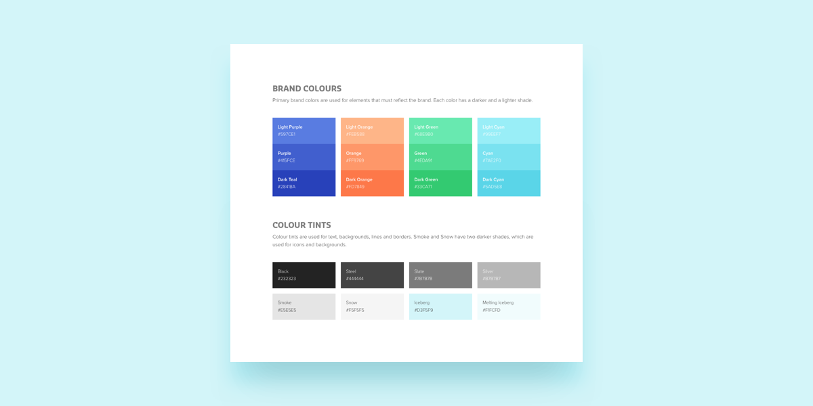
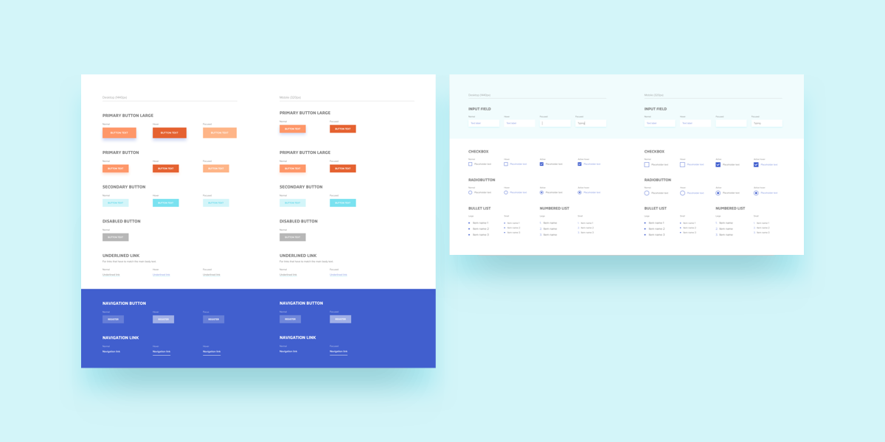
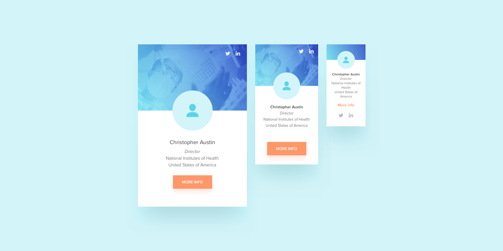
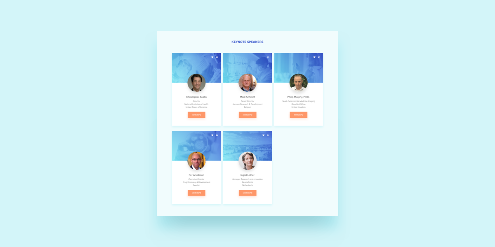
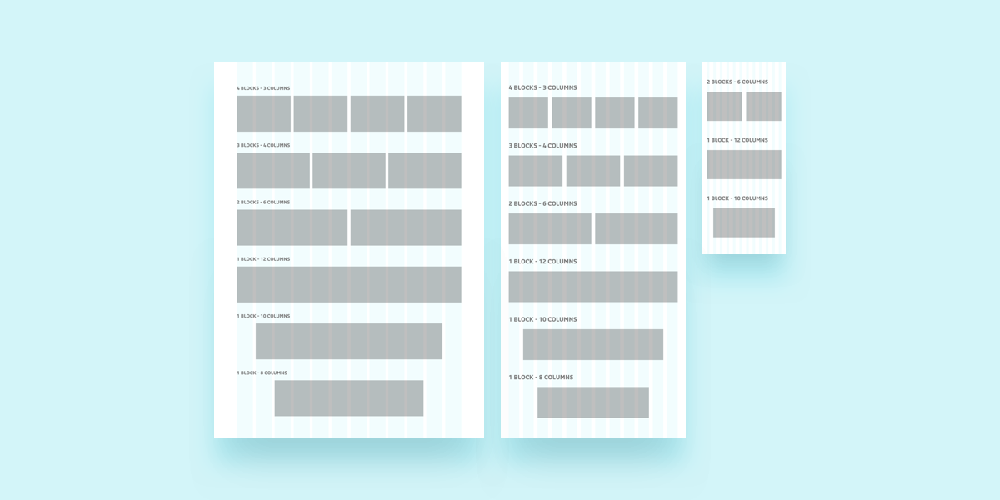
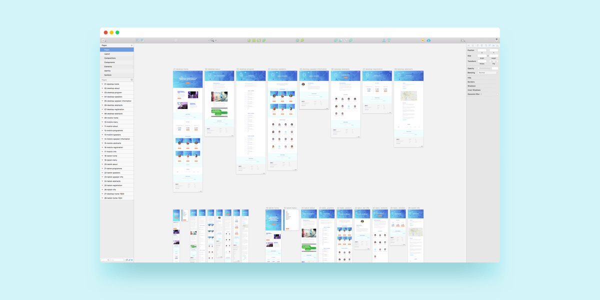
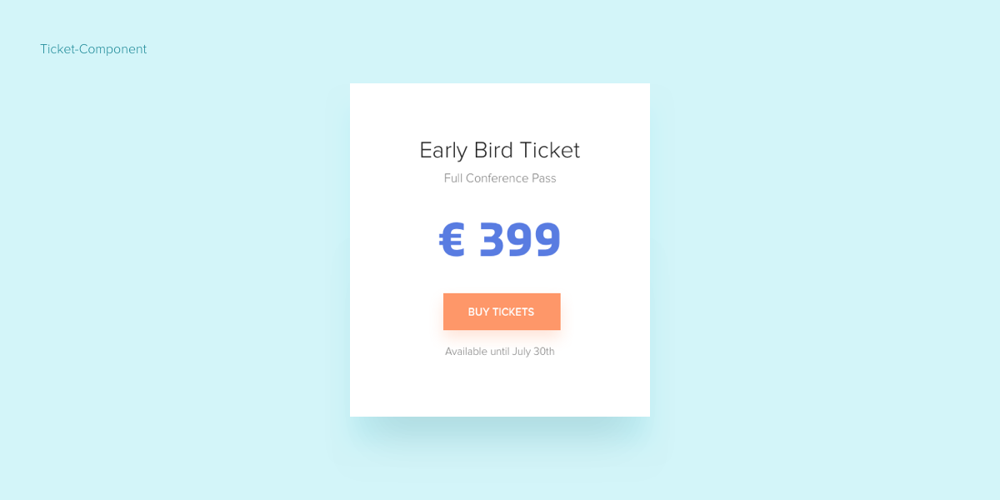
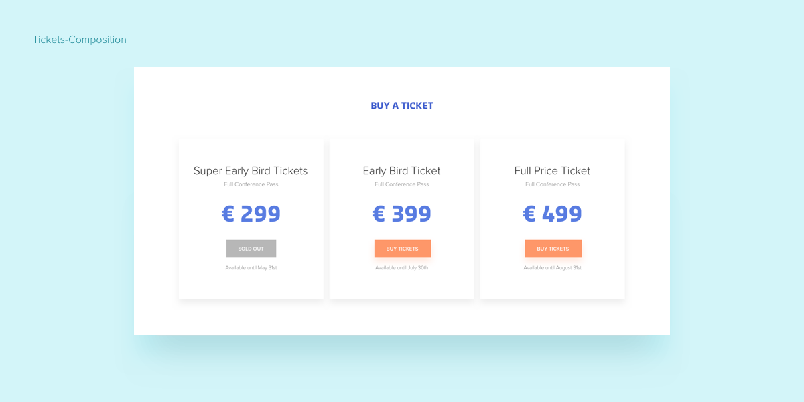

# 基于组件的设计规范(译)
[文章原文](https://medium.com/@wereheavyweight/how-were-using-component-based-design-5f9e3176babb#.k749c435l)

基于组件的设计经常在大型复杂项目的背景下进行讨论。在本文中，我们假设它对小型项目和团队也非常有益。我们使用基于组件的设计来处理每个项目,无论大小。     

首先，我们向布拉德弗罗斯特（Brad Frost）致敬，他从字面上写了一本关于原子设计的书。他向我们介绍了我们实际上并没有设计网页或应用程序屏幕，而是实际设计设计系统的想法。   

但是，我们发现原子设计的隐喻性质引起了客户的一些困惑。特别是抽象的命名约定可能有点令人生畏。因此，我们定义了自己的看法——基于组件的设计，当然是从其他伟大的设计师那里借来的。

## 让我们深入探讨：它是什么？
> 从本质上讲，基于组件的设计是将UI拆分为更小，更易于管理的部分，并且名称清晰的实践。这些部分中的每一部分都属于六个不同的‘组’中的一个。

### 1.特征 Identity  

这六个组中的第一个是特征(或者称之为主题)。在这里，我们定义项目的核心品牌元素。字体，排版，主要和次要颜色都经过精心指定。之后这些会贯穿整个项目。

### 2.元素 Elements  

第二组定义项目最小的可重用部分：元素。一些众所周知的元素例子是：按钮，链接，输入，下拉等。每个元素都被定义，以及它们的所有状态：例如悬停，焦点和禁用按钮。我们的口号是：定义一次，在整个项目中重复使用。  
  

### 3.组件 Components
按比例扩大规模，第三组是组件。在设计应用程序和Web设计时，屏幕上的大多数块都是组件。组件可以是至少使用少量元素的任何组件。诸如卡片，头像和导航菜单之类的东西是组件的传统示例。但是，它们不一定要模块化。   
  
  
  
在设计组件时，我们还会立即为项目的每个响应大小（或断点）创建它的版本。通过这种方式，我们永远不必回溯到我们几周前设计的屏幕，然后让它们适合智能手机。响应目标事先与客户达成一致，每个组件都相应地进行设计。  

### 4.组合体 Compositions
再次提升规模，第四组是组合体。组合是包含多个组件的部件。它们定义了内部组件的行为方式。  

下面是一个简单列布局的示例。这是一个非常简单的组合体。它只定义了组合体周围的一些空白区域，标题以及里面的组件应如何循环。  
  

### 5.布局 Layout
第五组布局是一个更抽象的设计原则集合。这里定义了空白，网格和包装器(注:如，卡片等等)的数量。通过这样定义它们，其他设计人员很容易进入项目并使用现有的样式和指南。  
  

### 6.页面 Pages 
最后一组是项目的实际页面（或屏幕）。每个页面由组合体和组件的排列组成。  

所有个性化都在页面级别定义。如果联系人页面应该有蓝色背景，那么我们应当在这一层添加。  
  

## 例子
让我们看一个基于组件的设计的一个非常简单的例子。  
  
比如说我们要卖某个活动的票。有三种不同的票。每个票据都以相同的方式表示，其中的元素数量有限，在本例中是一个按钮和一些文本。这意味着票据应该表示为一个组件:票据组件。  

现在，假设我们希望在主页上以一个简单的三列布局显示这三张票。这就是我们决定设计一个组合的地方:Tickets-Composition。这个组合指定每个ticket组件之间应该有一些空间，并在它们上面有一个标题

  
   
项目启动两天后，客户想在门票上添加一些文本，说票已经卖完了。这意味着我们只需要更新Ticket-Component并将其发送给开发人员，这样效率非常高，改动非常小

## 实践 
在网页的UI开发和设计中，做到真正效率的事情无疑是UI复用，这就需要我们要以一定的方式去设计可复用的UI库，一方面能增加设计和开发上的效率，另一方面，可以体现一个技术团队的风格。这里有些组件库可以作为参考。
1. [Vuetify](https://vuetifyjs.com/zh-Hans/components/api-explorer),一个基于[Material Design](https://material.io/)设计风格的UI组件库。

2. [Element](http://element-cn.eleme.io/#/zh-CN/component/layout)，饿了么团队设计的UI组件库。

3. [spectre](https://picturepan2.github.io/spectre/elements/typography.html),轻量级的UI组件库。